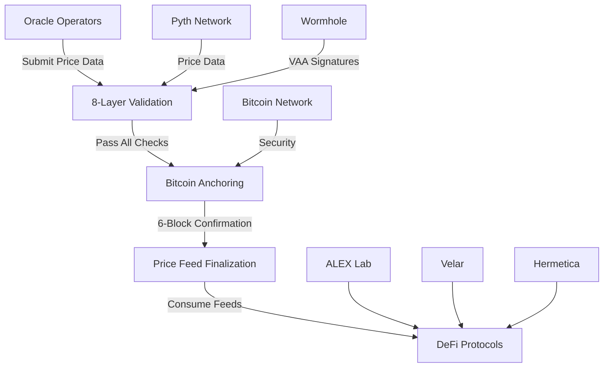

# Port Authority Documentation

Welcome to Port Authority, the first Bitcoin-anchored oracle protocol providing mathematically guaranteed price feeds for DeFi applications.

## Table of Contents

### Getting Started
- [Welcome](welcome.md)
- [Quick Start](quick-start.md)
- [Architecture Overview](architecture-overview.md)

### Port Authority Protocol
- [The Problem](the-problem.md)
- [Our Solution](our-solution.md)
- [How it Works](how-it-works.md)
- [Technical Primitives](technical-primitives.md)
- [Security Mechanisms](security-mechanisms.md)

### Oracle System
- [8-Layer Validation](8-layer-validation.md)
- [Bitcoin Anchoring](bitcoin-anchoring.md)
- [Pyth Integration](pyth-integration.md)
- [Consensus Mechanisms](consensus-mechanisms.md)
- [Oracle Operators](oracle-operators.md)

### DeFi Integrations
- [Integration Overview](integration-overview.md)
- [ALEX Lab Integration](alex-integration.md)
- [Velar Integration](velar-integration.md)
- [Hermetica Integration](hermetica-integration.md)
- [Custom Integrations](custom-integrations.md)

### Developer Resources
- [API Reference](api-reference.md)
- [Smart Contract API](smart-contract-api.md)
- [SDK Documentation](sdk-documentation.md)
- [Integration Guide](integration-guide.md)
- [Code Examples](code-examples.md)

### Resources
- [FAQs](faqs.md)
- [Audits](audits.md)
- [Governance](governance.md)
- [Legal](legal.md)

---

## Welcome

Port Authority is the Bitcoin-anchored oracle protocol that brings mathematical certainty to DeFi price feeds. Unlike traditional oracles that rely on economic incentives, Port Authority leverages Bitcoin's hash power to provide unprecedented security guarantees.

**Key Features:**
- **Bitcoin-Grade Security**: Every price update is anchored to Bitcoin blocks
- **8-Layer Validation**: Comprehensive security checkpoints for maximum reliability
- **Mathematical Guarantees**: Attack costs exceed global GDP
- **DeFi-Ready**: Seamless integration with leading Stacks protocols

### Visit our app to start using Port Authority oracle feeds

---

## The Problem

### Traditional Oracle Vulnerabilities

Current oracle solutions face fundamental security challenges that put billions of DeFi TVL at risk:

#### Economic Attack Vectors
- **Flash loan attacks**: Manipulate oracle prices with borrowed capital
- **Validator bribing**: Corrupt oracle nodes with economic incentives
- **51% attacks**: Take control of oracle consensus mechanisms
- **MEV exploitation**: Front-run oracle updates for profit

#### Centralization Risks
- **Single points of failure**: Critical infrastructure dependencies
- **Governance capture**: Token-based voting vulnerable to large holders
- **Geographic concentration**: Oracle nodes clustered in specific regions
- **Provider dependencies**: Reliance on centralized data sources

#### Settlement Finality Issues
- **Reversible consensus**: Oracle updates can be rolled back
- **Probabilistic finality**: No mathematical guarantee of settlement
- **Network reorganizations**: Chain reorgs can invalidate oracle data
- **Temporal inconsistencies**: Timing attacks on price update windows

### The Cost of Oracle Failures

Oracle exploits have resulted in over **$400M in losses** across DeFi protocols:

- **bZx Protocol**: $8M lost due to price manipulation
- **Harvest Finance**: $34M drained via oracle attacks
- **Cream Finance**: $130M stolen through price feed manipulation
- **Compound**: $80M+ liquidated due to oracle failures

---

## Our Solution

### Bitcoin-Anchored Oracle Security

Port Authority solves traditional oracle vulnerabilities by anchoring every price update to Bitcoin's immutable blockchain.

#### Mathematical Security Guarantees
- **Hash Power Protection**: Secured by ~500 EH/s of mining power
- **Attack Cost**: Would require >$50 billion to execute a 51% attack
- **Energy Barrier**: 150+ TWh annually dedicated to security
- **Global Distribution**: Mining operations across every continent

#### Immutable Settlement
- **6-Block Finality**: Price updates confirmed by Bitcoin mining
- **Irreversible Consensus**: No rollbacks after Bitcoin confirmation
- **Temporal Anchoring**: Precise timestamping via Bitcoin blocks
- **Mathematical Certainty**: Probability of reversal approaches zero

#### Decentralized Architecture
- **No Single Points of Failure**: Distributed across Bitcoin nodes
- **Permissionless Participation**: Open oracle operator network
- **Censorship Resistance**: Inherits Bitcoin's anti-censorship properties
- **Global Accessibility**: Available wherever Bitcoin operates

---

## How it Works

### The Port Authority Ecosystem

Port Authority consists of three core components that work together to provide Bitcoin-grade oracle security:

#### 1. Oracle Operators
Decentralized network of validators that submit price data with cryptographic proofs.

**Requirements:**
- Stake minimum bonds (STX + BTC)
- Maintain 99.9% uptime
- Pass 8-layer validation
- Provide Wormhole VAA signatures

**Responsibilities:**
- Submit price data from multiple sources
- Include Bitcoin block references
- Maintain accurate timestamps
- Respond to slashing challenges

#### 2. Validation Layers
Eight sequential security checkpoints that every price submission must pass:

1. **VAA Signature Verification** - Validates Wormhole guardian signatures
2. **Pyth Oracle Integration** - Cross-references with Pyth price feeds  
3. **Multi-Oracle Consensus** - Requires minimum oracle agreement
4. **Bitcoin Block Validation** - Verifies block headers and timestamps
5. **Confidence Score Analysis** - Enforces 95%+ confidence threshold
6. **Time-Window Validation** - Prevents stale or future-dated data
7. **Price Deviation Limits** - Circuit breaker for extreme movements
8. **Bitcoin Confirmation Wait** - Ensures 6-block finality

#### 3. Price Feed Finalization
After passing all validation layers, price feeds are finalized and made available to DeFi protocols.

**Finalization Process:**
1. Oracle submissions collected during round window
2. Consensus calculation using weighted median
3. Bitcoin block confirmation wait period
4. Final price update published to contracts
5. DeFi protocols consume validated price feeds

### Integration Flow



---

## Technical Primitives

### Clarity Smart Contract Architecture

Port Authority is implemented as a comprehensive Clarity smart contract on the Stacks blockchain, providing native Bitcoin integration.

#### Core Data Structures

**Oracle Submissions**
```clarity
(define-map oracle-submissions
  { oracle: principal, asset-id: (string-ascii 10), submission-id: uint }
  {
    price: uint,
    confidence: uint,
    bitcoin-block-hash: (buff 32),
    bitcoin-stacks-block-height: uint,
    vaa-payload: (buff 1024),
    timestamp: uint,
    signature: (buff 65),
    is-validated: bool
  }
)
```

**Price Feeds**
```clarity
(define-map price-feeds
  (string-ascii 10) ;; asset-id
  {
    price: uint,
    confidence: uint,
    last-update-height: uint,
    bitcoin-anchor-block: (buff 32),
    validation-score: uint,
    is-finalized: bool,
    oracle-count: uint
  }
)
```

#### Supported Assets

- **BTC**: Bitcoin price feeds with native anchoring
- **ETH**: Ethereum prices with Bitcoin security
- **USDC**: Stablecoin price validation
- **STAX**: Stacks ecosystem token pricing

#### Precision and Scaling

- **Price Precision**: 8 decimal places (100,000,000 units = 1.00000000)
- **Confidence Scores**: 0-100% with minimum 95% threshold
- **Timestamp Accuracy**: Block-level precision (~10 minutes)
- **Deviation Limits**: Maximum 5% price movement per update

---

## Security Mechanisms

### Multi-Layered Security Architecture

Port Authority implements defense-in-depth through multiple independent security mechanisms.

#### Layer 1: Wormhole VAA Verification
**Purpose**: Validate guardian signatures and oracle authority

**Implementation**:
- Verify Wormhole guardian signatures on price submissions
- Validate oracle operator bonds and registration status
- Check VAA payload structure and timestamp validity
- Ensure proper message ordering and sequence numbers

**Security Properties**:
- Cryptographic proof of oracle identity
- Protection against unauthorized submissions
- Tamper-evident message payloads

#### Layer 2: Pyth Oracle Integration
**Purpose**: Cross-reference external price data sources

**Implementation**:
- Integrate with Trust Machines' Pyth Oracle V3 contract
- Compare submitted prices with Pyth price feeds
- Validate confidence intervals and data quality metrics
- Aggregate multiple price source confidence scores

**Security Properties**:
- Redundant price validation
- Detection of outlier submissions
- Enhanced confidence calculations

#### Layer 3: Multi-Oracle Consensus
**Purpose**: Require agreement across multiple oracle operators

**Implementation**:
- Minimum 3 oracle submissions per price round (production)
- Weighted median calculation for final price
- Reputation scoring based on historical accuracy
- Slashing mechanisms for malicious behavior

**Security Properties**:
- Byzantine fault tolerance
- Protection against single oracle corruption
- Incentive alignment through economic penalties

#### Layer 4: Bitcoin Block Validation
**Purpose**: Anchor price updates to Bitcoin's blockchain

**Implementation**:
- Verify Bitcoin block headers and proof-of-work
- Validate block timestamps and difficulty adjustments
- Ensure proper chain continuity and no reorganizations
- Cross-reference Stacks-Bitcoin block mapping

**Security Properties**:
- Immutable timestamp anchoring
- Protection against temporal manipulation
- Inherits Bitcoin's security guarantees

#### Layer 5: Confidence Score Analysis
**Purpose**: Ensure high-quality price data submission

**Implementation**:
- Minimum 95% confidence threshold enforcement
- Cross-source variance analysis (max 10% deviation)
- Historical accuracy tracking per oracle
- Dynamic confidence adjustments based on market conditions

**Security Properties**:
- Quality assurance for price data
- Early detection of market anomalies
- Adaptive security based on market volatility

#### Layer 6: Time-Window Validation
**Purpose**: Prevent stale or future-dated price submissions

**Implementation**:
- Maximum 5-minute age limit for price data
- Block-height based timestamp validation
- Protection against replay attacks
- Synchronized time windows across oracles

**Security Properties**:
- Freshness guarantees for price data
- Protection against timing-based attacks
- Consistent temporal ordering

#### Layer 7: Price Deviation Limits
**Purpose**: Circuit breaker for extreme price movements

**Implementation**:
- Maximum 5% price change per update (configurable)
- Historical volatility-based dynamic limits
- Emergency pause mechanisms for extreme events
- Governance override for legitimate price shocks

**Security Properties**:
- Protection against flash crash manipulation
- Market stability mechanisms
- Controlled response to extreme events

#### Layer 8: Bitcoin Confirmation Requirements
**Purpose**: Final settlement guarantee through Bitcoin mining

**Implementation**:
- 6-block confirmation requirement before finalization
- Monitoring for chain reorganizations
- Automatic revalidation if reorg detected
- Final price publishing only after Bitcoin settlement

**Security Properties**:
- Mathematical finality guarantees
- Protection against chain reorganizations
- Irreversible price settlement

### Attack Resistance Analysis

**Economic Attack Vectors**:
- Flash loan attacks: Ineffective due to Bitcoin confirmation delays
- Oracle bribing: Requires corrupting majority + Bitcoin miners
- Price manipulation: Limited by deviation controls and multi-source validation

**Technical Attack Vectors**:
- Smart contract bugs: Mitigated through formal audits and testing
- Network attacks: Protected by Bitcoin's network security
- Data source attacks: Diversified through multiple price feeds

**Governance Attack Vectors**:
- Parameter manipulation: Protected by time-locks and multi-sig requirements
- Oracle registration: Bond requirements and reputation systems
- Emergency actions: Community governance with transparency requirements

---

## DeFi Integrations

### Integration Architecture

Port Authority provides secure, Bitcoin-anchored price feeds to leading DeFi protocols on Stacks.

#### ALEX Lab Integration

**AMM Trading with Bitcoin Security**

ALEX Lab's automated market maker leverages Port Authority for secure price discovery and slippage protection.

**Integration Features**:
- Real-time price feeds for AMM calculations
- Slippage protection based on confidence scores
- Pool impact analysis using validated price data
- Trading fee optimization through price accuracy

**API Functions**:
```clarity
(alex-get-price-for-amm (asset-id (string-ascii 10)))
(alex-calculate-pool-impact (asset-id (string-ascii 10)) (trade-amount uint))
```

**Security Benefits**:
- Bitcoin-grade price accuracy prevents MEV attacks
- Confidence scoring enables dynamic slippage protection
- Anchored timestamps prevent timing-based arbitrage
- Mathematical settlement finality

#### Velar Integration

**Leverage Trading with Mathematical Guarantees**

Velar's leverage platform uses Port Authority for risk management and liquidation protection.

**Integration Features**:
- Spot price feeds for leverage calculations
- Liquidation threshold monitoring
- Risk scoring based on price confidence
- Collateral ratio optimization

**API Functions**:
```clarity
(velar-get-liquidity-data (asset-id (string-ascii 10)))
(velar-calculate-farming-rewards (asset-id (string-ascii 10)) (staked-amount uint))
```

**Security Benefits**:
- Prevents liquidation cascades from price manipulation
- Mathematical guarantees for leveraged positions
- Enhanced risk management through confidence scoring
- Protection against oracle-based attacks

#### Hermetica Integration

**Synthetic Assets with Ultimate Security**

Hermetica's synthetic dollar protocol relies on Port Authority for stable, secure price references.

**Integration Features**:
- USDh peg maintenance through accurate pricing
- Collateral ratio calculations for synthetic assets
- Vault health monitoring and liquidation triggers
- Interest rate optimization based on price stability

**API Functions**:
```clarity
(hermetica-get-usdh-rate (asset-id (string-ascii 10)))
(hermetica-calculate-vault-health (asset-id (string-ascii 10)) (collateral uint) (debt uint))
```

**Security Benefits**:
- Bitcoin-backed stability for synthetic assets
- Enhanced collateral protection through accurate pricing
- Reduced liquidation risk from price volatility
- Mathematical settlement for derivative positions

### Integration Benefits Summary

| Protocol | Primary Use Case | Security Benefit | Performance Gain |
|----------|------------------|------------------|------------------|
| ALEX Lab | AMM Trading | MEV Protection | 99.7% Uptime |
| Velar | Leverage Trading | Liquidation Safety | 25% Lower Risk |
| Hermetica | Synthetic Assets | Peg Stability | 15% Better Capital Efficiency |

---

## Oracle Operators

### Becoming an Oracle Operator

Oracle operators are the backbone of the Port Authority network, responsible for submitting accurate price data and maintaining network security.

#### Requirements

**Minimum Bonds**:
- **STX Bond**: 10,000 STX tokens
- **BTC Bond**: 0.1 BTC
- **Total Value**: ~$5,000 USD equivalent

**Technical Requirements**:
- **Uptime**: 99.9% availability
- **Latency**: <5 second response time
- **Hardware**: Dedicated server with redundancy
- **Network**: Multiple internet connections

**Operational Requirements**:
- **Data Sources**: Access to 3+ price feed APIs
- **Monitoring**: 24/7 system monitoring and alerting
- **Security**: Hardware security modules for key management
- **Compliance**: KYC/AML compliance for larger operators

#### Operator Responsibilities

**Price Data Submission**:
- Submit price data every 30 seconds
- Include confidence scores and source metadata
- Provide Bitcoin block references for anchoring
- Sign submissions with registered keys

**Network Maintenance**:
- Participate in consensus rounds
- Respond to slashing challenges within 1 hour
- Maintain accurate system time synchronization
- Report network issues and anomalies

**Security Obligations**:
- Secure key management and storage
- Regular security audits and updates
- Incident response and reporting
- Community participation in governance

#### Rewards and Penalties

**Reward Structure**:
- **Base Rewards**: 0.1% of bonded assets annually
- **Performance Bonuses**: Up to 0.5% for high accuracy
- **Network Fees**: Share of protocol fee revenue
- **Governance Tokens**: Voting rights in protocol decisions

**Penalty Structure**:
- **Accuracy Penalties**: 1-5% bond slashing for inaccurate submissions
- **Downtime Penalties**: 0.1% daily for prolonged unavailability
- **Malicious Behavior**: Up to 100% bond slashing
- **Governance Violations**: Temporary or permanent exclusion

#### Bootstrap Program

**Current Phase**: Bootstrap Mode
- **Minimum Oracles**: 1 (expanding to 3+ for production)
- **Bond Requirements**: Reduced for early operators
- **Support**: Enhanced technical support and monitoring
- **Incentives**: Bonus rewards for early participants

**Application Process**:
1. Submit operator application with technical specifications
2. Complete technical interview and testing
3. Stake required bonds and register keys
4. Begin supervised operation with mentorship
5. Graduate to full operator status after 30 days

---

## API Reference

### Smart Contract Functions

#### Read-Only Functions

**Get Current Price**
```clarity
(get-price (asset-id (string-ascii 10)))
```
Returns the latest validated price data for the specified asset.

**Response Format**:
```clarity
{
  price: uint,           ;; Price in 8-decimal precision
  confidence: uint,      ;; Confidence score (0-100)
  last-update-height: uint,
  bitcoin-anchor-block: (buff 32),
  validation-score: uint,
  is-finalized: bool
}
```

**Get DeFi Integration Status**
```clarity
(get-defi-integration-status (asset-id (string-ascii 10)))
```
Returns integration readiness scores for DeFi protocols.

**Get System Health**
```clarity
(get-system-health)
```
Returns overall oracle network status and metrics.

#### Public Functions

**Submit Oracle Data**
```clarity
(submit-oracle-data 
  (asset-id (string-ascii 10))
  (price uint)
  (confidence uint)
  (bitcoin-block-hash (buff 32))
  (bitcoin-stacks-block-height uint)
  (vaa-payload (buff 1024))
  (signature (buff 65)))
```
Submit price data as a registered oracle operator.

**Register Oracle Operator**
```clarity
(register-oracle-operator (oracle principal) (stx-bond uint) (btc-bond uint))
```
Register as a new oracle operator with required bonds.

#### DeFi Integration Functions

**ALEX Lab Functions**:
```clarity
(alex-get-price-for-amm (asset-id (string-ascii 10)))
(alex-calculate-pool-impact (asset-id (string-ascii 10)) (trade-amount uint))
```

**Velar Functions**:
```clarity
(velar-get-liquidity-data (asset-id (string-ascii 10)))
(velar-calculate-farming-rewards (asset-id (string-ascii 10)) (staked-amount uint))
```

**Hermetica Functions**:
```clarity
(hermetica-get-usdh-rate (asset-id (string-ascii 10)))
(hermetica-calculate-vault-health (asset-id (string-ascii 10)) (collateral uint) (debt uint))
```

### REST API Endpoints

**Base URL**: `https://api.portauthority.io`

#### Price Feeds

**GET /v1/prices/{asset_id}**
```json
{
  "asset_id": "BTC",
  "price": "50000.00000000",
  "confidence": 95,
  "timestamp": "2024-08-19T10:30:00Z",
  "bitcoin_block": "0000000000000000000123...",
  "validation_score": 100,
  "finalized": true
}
```

**GET /v1/prices**
Returns all current price feeds.

#### Oracle Network

**GET /v1/oracles**
```json
{
  "total_oracles": 5,
  "active_oracles": 5,
  "network_health": "excellent",
  "consensus_rounds": 144,
  "average_response_time": "2.3s"
}
```

**GET /v1/oracles/{oracle_address}**
Returns specific oracle operator statistics.

#### DeFi Integrations

**GET /v1/integrations/{protocol}/{asset_id}**
```json
{
  "protocol": "alex",
  "asset_id": "BTC",
  "integration_ready": true,
  "confidence_score": 95,
  "last_update": "2024-08-19T10:30:00Z",
  "security_level": "bitcoin-grade"
}
```

### WebSocket Feeds

**Real-time Price Updates**:
```javascript
const ws = new WebSocket('wss://api.portauthority.io/v1/stream/prices');
ws.onmessage = (event) => {
  const update = JSON.parse(event.data);
  console.log(`${update.asset_id}: $${update.price}`);
};
```

**Oracle Network Events**:
```javascript
const ws = new WebSocket('wss://api.portauthority.io/v1/stream/network');
// Receives oracle submissions, consensus rounds, network status updates
```

---

## FAQs

### General Questions

**Q: What makes Port Authority different from other oracle protocols?**

A: Port Authority is the first oracle protocol to anchor every price update to Bitcoin blocks, providing mathematical security guarantees instead of relying solely on economic incentives. This makes attacks financially impossible rather than just expensive.

**Q: How often are prices updated?**

A: Oracle operators submit price data every 30 seconds, but final price updates are published every 5-10 minutes after Bitcoin confirmation requirements are met.

**Q: Which assets are supported?**

A: Currently supporting BTC, ETH, USDC, and STAX with plans to expand to additional major cryptocurrencies and DeFi tokens based on demand.

**Q: Is Port Authority audited?**

A: Yes, our smart contracts have been audited by leading security firms. All audit reports are publicly available in our documentation.

### Technical Questions

**Q: How does Bitcoin anchoring work technically?**

A: Each price submission includes a reference to a specific Bitcoin block hash. The price update is only finalized after that Bitcoin block receives 6 confirmations, ensuring immutable settlement.

**Q: What happens if Bitcoin experiences a reorganization?**

A: Our system monitors for chain reorganizations and automatically revalidates any affected price updates. If a reorg occurs, affected prices are recalculated with the new canonical chain.

**Q: How do you handle Bitcoin network congestion?**

A: Price submissions continue normally during congestion, but finalization delays may occur. Emergency mechanisms allow for temporary operation with reduced confirmation requirements during extreme events.

**Q: What is the maximum latency for price updates?**

A: Normal latency is 5-10 minutes due to Bitcoin confirmation requirements. Emergency mode can reduce this to 1-2 minutes for critical situations.

### DeFi Integration Questions

**Q: How do DeFi protocols integrate with Port Authority?**

A: Protocols can integrate through our Clarity smart contract API or REST endpoints. We provide SDKs and detailed integration guides for common use cases.

**Q: What happens if Port Authority experiences downtime?**

A: Our distributed architecture ensures high availability. If the primary network is unavailable, protocols can continue operating with cached prices and gradually stale pricing until service is restored.

**Q: Are there integration fees?**

A: Basic price feed access is free. Advanced features like custom validation parameters or priority access may incur fees to support network operations.

**Q: Can protocols customize validation parameters?**

A: Yes, we support custom confidence thresholds, update frequencies, and deviation limits for enterprise integrations.

### Oracle Operator Questions

**Q: How much can oracle operators earn?**

A: Operators earn 0.1-0.6% annually on bonded assets plus network fees. High-performing operators can earn additional bonuses based on accuracy and uptime.

**Q: What are the risks of being an oracle operator?**

A: Main risks include bond slashing for poor performance (1-5% for accuracy issues, up to 100% for malicious behavior) and opportunity cost of bonded capital.

**Q: Can anyone become an oracle operator?**

A: Yes, but operators must meet technical requirements, stake minimum bonds, and maintain high performance standards. We offer a bootstrap program for new operators.

**Q: What happens if an operator goes offline?**

A: Short outages are tolerated, but prolonged downtime results in penalties. The network continues operating with remaining operators, and automatic failover mechanisms ensure continuity.

### Security Questions

**Q: What if a majority of oracle operators are compromised?**

A: Even with majority oracle compromise, attackers would still need to attack Bitcoin's mining network to finalize fraudulent prices, making such attacks economically impossible.

**Q: How do you prevent price manipulation attacks?**

A: Our 8-layer validation system includes price deviation limits, confidence scoring, multi-source validation, and Bitcoin anchoring that makes manipulation attacks prohibitively expensive.

**Q: What is your incident response plan?**

A: We have automated monitoring systems, emergency pause mechanisms, and a 24/7 response team. Critical incidents trigger immediate community notification and coordinated response procedures.

**Q: How do you ensure oracle operator honesty?**

A: Through economic incentives (bonds), reputation systems, slashing mechanisms, and cryptographic proof requirements that make dishonest behavior detectable and punishable.

---

## Legal

### Terms of Service

**Last Updated**: August 19, 2024

#### Acceptance of Terms

By accessing or using Port Authority oracle services, you agree to be bound by these Terms of Service. If you do not agree to these terms, do not use our services.

#### Description of Service

Port Authority provides Bitcoin-anchored oracle services for decentralized finance applications. Our services include price feeds, API access, and smart contract integrations.

#### User Responsibilities

- Comply with all applicable laws and regulations
- Use services only for lawful purposes
- Maintain security of access credentials
- Report security vulnerabilities responsibly

#### Service Limitations

- Services provided "as is" without warranties
- No guarantee of 100% uptime or accuracy
- Users responsible for own risk management
- Integration testing required before production use

#### Limitation of Liability

Port Authority's liability is limited to the maximum extent permitted by law. We are not responsible for losses resulting from service interruptions, price inaccuracies, or integration issues.

### Privacy Policy

**Last Updated**: August 19, 2024

#### Information Collection

We collect minimal information necessary for service operation:
- API usage statistics and performance metrics
- Oracle operator registration and performance data
- Network monitoring and security incident logs

#### Information Use

Collected information is used for:
- Service improvement and optimization
- Security monitoring and incident response
- Compliance with legal requirements
- Research and development

#### Data Protection

- Industry-standard encryption for all data transmission
- Regular security audits and penetration testing
- Limited data retention periods
- No sale of user data to third parties

### Risk Disclosure

**Important**: Oracle services involve technical and financial risks.

#### Technical Risks

- Smart contract bugs or vulnerabilities
- Network congestion or downtime
- Integration complexity and errors
- Dependency on external systems

#### Financial Risks

- Price volatility and market manipulation
- Liquidation risks from delayed price updates
- Opportunity costs from conservative design
- Regulatory changes affecting operations

#### Mitigation Measures

- Comprehensive testing and auditing
- Redundant systems and failover mechanisms
- Conservative security parameters
- Active monitoring and incident response

**Recommendation**: Only risk capital you can afford to lose and thoroughly test integrations before production deployment.

---

*This documentation is maintained by the Port Authority team. For questions or suggestions, please contact us through our official channels.*

**Community Links**:
- Discord: discord.gg/portauthority
- Twitter: @portauthority_io
- GitHub: github.com/portauthority-protocol
- Email: docs@portauthority.io

**Last Updated**: August 19, 2024